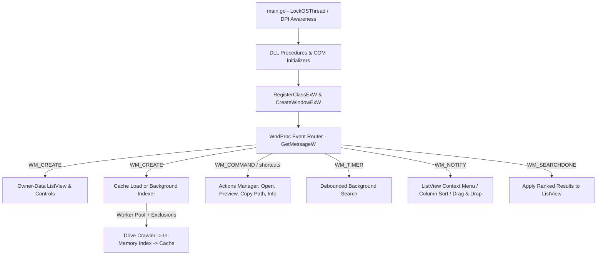
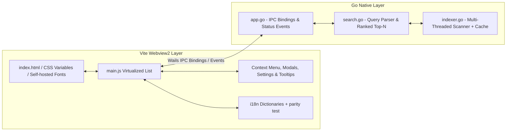

# QBFind: High-Performance Windows Desktop File Finder

[](https://golang.org)
[](LICENSE)
[](https://microsoft.com)

**QBFind** is a professional-grade, high-performance desktop file finder built specifically for Microsoft Windows. To cater to both retro-performance enthusiasts and lovers of modern, sleek UI aesthetics, QBFind is distributed in **two distinct, specialized editions**:

---

## 💎 Dual-Edition Architecture

| Feature | 🚀 QBFind Classic (Win32 Edition) | ✨ QBFind Premium (Wails Edition) |
| :--- | :--- | :--- |
| **User Interface** | Pure Native Win32 Controls (SysListView32, Edit, Static) | Modern Pitch-Black (#000000) & Apple-style Light Theme |
| **Tech Stack** | Pure Go, Raw Windows DLL APIs, Win32 Message Loop | Go Backend, Wails Runtime, Vite, HTML5, Vanilla CSS3, JS |
| **Executable Size**| Ultra-lightweight (~3.4 MB) | Compact Premium Desktop App (~12 MB) |
| **Memory / CPU** | Near-zero footprint, instant cold-starts | Low-footprint GPU-accelerated WebView2 rendering |
| **Key Highlights** | Manual COM/OLE drag-and-drop, raw Win32 windows | Cam-efektli (glassmorphic) sağ tık menüleri, akışkan mikro-animasyonlar, yerelleştirilmiş araç ipuçları (tooltips) |

---

## ⚡ Core Shared Features

*   **⚡ Parallel Multi-Threaded Scanning**: Implements a high-performance concurrent worker pool dynamically sized based on CPU cores:
    $$\text{Workers} = \min(\max(\text{NumCPU} \times 2, 2), 16)$$
    Crawls userspace paths (`Desktop`, `Downloads`, `Documents`, etc.) first to ensure instantaneous query availability upon startup. Unavailable drives (empty removable media, disconnected network shares) are probed and skipped.
*   **💾 Persistent Index Cache**: A gzip-compressed snapshot of the index is saved under `%APPDATA%/QBFind` after each scan, so the next launch can search immediately; use **Refresh** to re-scan the system.
*   **🎯 Intelligent Scoring & Ranking Engine**: Ranks results with a bounded top-N heap using a penalty/reward scoring algorithm based on path depth, folder priority, executable extensions, and Turkish character folding (`ı, İ, ç, ğ, ö, ş, ü` mappings).
*   **🔎 Rich Query Language**: Supports `ext:pdf` / `.pdf` / `*.pdf`, `name:report`, `path:documents`, `size:>10mb`, `size:1mb-10mb`, `date:today`, `date:>2024-01-01` and glob tokens such as `report*.pdf`.
*   **🚫 Folder Exclusions**: Semicolon-separated folder names/globs (`node_modules;.git;cache*`) can be excluded from scanning through the in-app settings dialog.
*   **🔍 In-App Text Preview**: Decodes UTF-8, UTF-16LE, and UTF-16BE files dynamically with Byte Order Mark (BOM) validation, displaying pretty-printed JSON and raw text previews up to 4,000 characters.
*   **🌍 Multilingual Support**: Real-time language switching between English and Turkish, with persistent configurations saved under `%APPDATA%/QBFind/settings.txt`. The Wails edition ships self-hosted Inter/Outfit fonts and an i18n parity test.

---

## 🏗️ Architecture & Workflows

### 1. Win32 Classic Message Loop


### 2. Wails Modern IPC Architecture


---

## 📂 Modular File Walkthrough

### 🚀 Classic Win32 Codebase (Root Directory)
*   **`quickfind.go`**: Entrypoint (`main`), DLL procedure bindings, Win32 structs, DPI awareness, keyboard shortcuts, and global variables.
*   **`ui.go`**: Native `wndProc` routing, child controls creation, layout constraints (`layoutControls`), and menu handling.
*   **`listview.go`**: Owner-data (`LVS_OWNERDATA`) virtual listview, column-click sorting, multi-selection, and context menu.
*   **`search.go`**: Async search generation pipeline (`WM_SEARCHDONE`), rich query parser (`name:`, `path:`, `size:`, `date:`, globs), Turkish text normalization (`searchFold`), and bounded top-N scoring (`scoreEntry`).
*   **`indexer.go`**: Concurrent drive scanning worker pool, drive-readiness probing, exclusions, junction/reparse point validation, folder prioritizer, and the persistent gzip index cache.
*   **`ole.go`**: Low-level COM interface simulation (VTables) for native Windows Drag-and-Drop (`DoDragDrop`), with panic-guarded callbacks.
*   **`settings.go`**: Key/value settings persistence (language, exclusions) and English/Turkish translation registers.
*   **`settingswindow.go`**: Native excluded-folders dialog.
*   **`actions.go`**: Native execution triggers (`ShellExecuteW`), desktop copy operations (`SHFileOperationW`), and metadata previews.
*   **`log.go`**: Rotating log file writer plus panic guards for callbacks.
*   **`utils.go`**: String transformations, numeric formatting, clipboard writers, and bitwise macros.

### ✨ Premium Wails Codebase (`/wailsapp`)
*   **`wailsapp/main.go`**: Go entrypoint setting up the Wails application instance, options, and windows size constraints.
*   **`wailsapp/app.go`**: Cross-compiled Go handlers bound to the frontend (search pipelines, clipboard, open file wrappers, scanning, exclusions, version).
*   **`wailsapp/indexer.go`**: Thread-safe parallel index crawler with drive probing, exclusions, gzip cache, and `status_update` events back to JS.
*   **`wailsapp/search.go`**: Query parser and bounded top-N ranking engine.
*   **`wailsapp/frontend/`**: The modern Webview2 UI stack powered by Vite, HTML5, Vanilla CSS3 (variables custom theme support), and Vanilla JavaScript modules.
*   **`wailsapp/frontend/src/i18n.js`**: Shared English/Turkish dictionaries, validated by `frontend/tests/i18n-check.mjs`.

---

## 🛠️ Compilation & Development Guides

The Classic Edition requires the Go version declared in the root `go.mod` (Go 1.26+). To compile the Premium Edition you will also need **Go 1.23+**, **Node.js 18+** and the **Wails CLI** installed (`go install github.com/wailsapp/wails/v2/cmd/wails@v2.11.0`).

> ℹ️ `frontend/dist` is build output and is not committed. Always build the Premium Edition with the Wails CLI, or run `npm run build` inside `wailsapp/frontend` before a plain `go build`.

### 1. Developing & Building Classic Win32 Edition
```powershell
# Run in development mode
go run .

# Compile optimized production standalone .exe (without console shell window)
go build -ldflags "-s -w -H windowsgui" -o QBFind_Classic.exe
```

### 2. Developing & Building Premium Wails Edition
```powershell
# Navigate to Wails app
cd wailsapp

# Run in live-development mode (with hot-reloads)
wails dev

# Compile optimized production standalone .exe
wails build -o QBFind_Premium.exe -clean -trimpath -ldflags "-s -w -X main.AppVersion=2.0.0"
```

### 3. Quality Checks
Both editions are checked in CI (`.github/workflows/ci.yml`). Locally:

```powershell
# Classic Win32 Edition (repository root)
go vet -unsafeptr=false ./...
go test ./...

# Premium Wails Edition
cd wailsapp
go vet -unsafeptr=false ./...
```

`-unsafeptr=false` disables only the `unsafeptr` analyzer: the Win32/COM interop intentionally converts callback `uintptr` arguments back to `unsafe.Pointer` (see `CONTRIBUTING.md` for the rationale). All other vet analyzers remain enabled.

---

## 🤝 Contribution Guidelines

We welcome contributions to both the Win32 Classic and Wails Premium editions! To maintain consistency:

1.  **Strict Modularization**: Keep Win32 API logic in the root directory and Wails-specific wrappers under the `/wailsapp` directory. Do not mix dependencies.
2.  **No Unnecessary Dependencies**: Classic edition must remain 100% Cgo-free and rely solely on raw system DLLs. Premium edition must use standard Vanilla CSS variables to ensure zero tailwind/unnecessary node-module overhead.
3.  **Bilingual Support**: Always implement localization for both English (`en`) and Turkish (`tr`) for any new strings, context menus, tooltips, or alerts.

---

## 🤝 Collaboration Acknowledgement

Both editions of this high-performance suite were designed, modularized, and refined through a pair-programming partnership with **Antigravity**, an advanced agentic AI coding assistant designed by the **Google DeepMind** team.

---

## 📄 License

This project is licensed under the MIT License - see the [LICENSE](LICENSE) file for details.
